## Jigsaw: 2

Documentation referencing vulnerabilites found on the vulnerable machine: **''Jigsaw: 2''**. You can also use this documentation as a reference guide to learn ethical hacking.

- The `LINK.lst` file contains the URL to Jigsaw: 2.

      Happy Hacking!

---
### Feature

- #### Category:

  - _Improper Access Control_

- #### CWE-79:

  - _CWE-285: Improper Authorization_
  - _CWE-540: Information Leak Through Source Code_

- #### Goal:

  - Exploit port knocking on jigsaw2 VM
  - Exploit an improper access control vulnerability to access vulnerable .php source code

- #### Recommendation:

  - Implement role-based access control mechanisms
  - Implement attribute-based access control mechanisms
  - Implement principle of least privilege

### Hacker's software

| Software Name  | Version  |
| -------------- | -------- |
| Kali Linux     | 5.15.0   |
| Firefox ESR    | 91.5.0   |
| Nmap           | 7.92     |
| HTTPie         | 3.2.1    |
| Dirsearch      | 0.4.3    |
| SecLists       | 2023.4   |
| Strings        | 2.42     |
| Python         | 3.9.10   |
| Universal Leet | 15.04.27 |

### TOE

---

Given we access the Vulnhub website

We download the .7z file associated with "jigsaw2"

We check its MD5 hash code

    md5 jigsaw2.7z

We check its SHA1 hash code

    shasum jigsaw2.7z

We confirm that the vulnerable VM's checksums match

We read the vulnerable VM's description which says

    Difficulty: Insane

    It has 2 flags.

    Certain functionality only work with VMware.

We extract the vulnerable VM's .7z file data

We import jigsaw2 .ova file to VMware

---
### Scenario -- _Normal use case_

Given We start the vulnerable VM on VMware

We see that the vulnerable VM prompts me to a login screen

We start our Kali Linux VM on VMware

We set our Kali Linux VM to bridged mode in VMware

We set the vulnerable VM to bridged mode in VMware

both machines are on the same local network

---
### Scenario -- _Static Detection_

Given both machines are on the same local network

We get the network address of the WLAN

    ip route

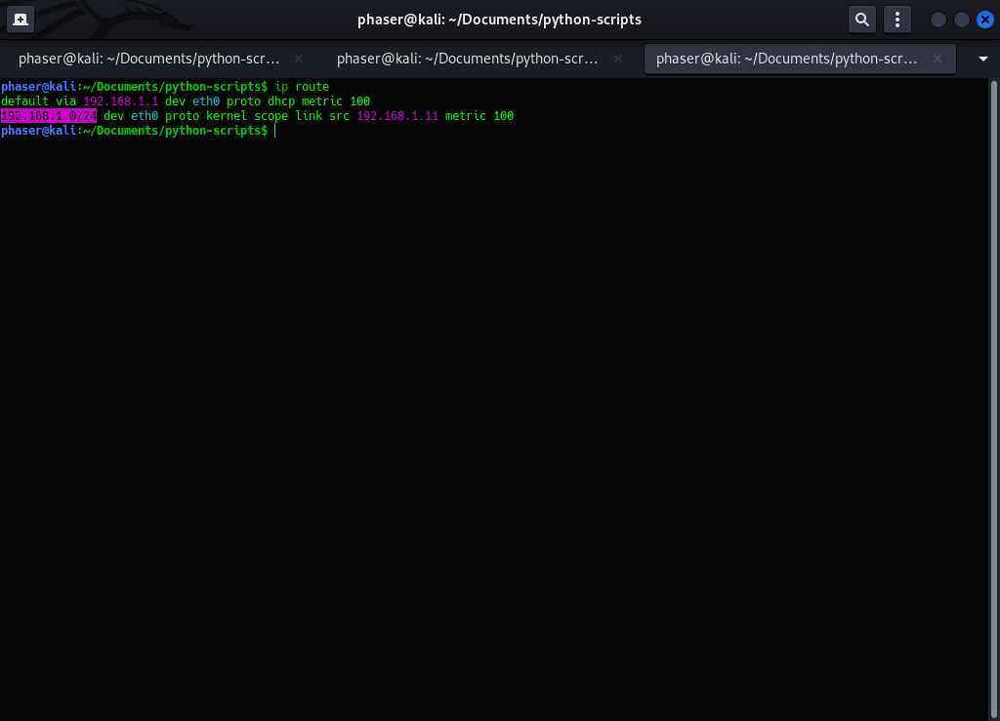

---
### Scenario -- _Dynamic Detection_

Given we have the network address of the WLAN

We use Nmap on my Kali Linux VM

We send ICMP Echo Requests (ping) packets to the network address

    sudo nmap -sn 192.168.1.0/24

We find the vulnerable VM's IP address

We search for open ports on the vulnerable VM using Nmap

We see that "ssh", "http", as well as "rpcbind" ports are open

We check the source code of the site by using "httpie"

We see that it is hosting a file called "main.js"

We see the contents of "main.js" as well as its API

    http http://192.168.1.10/main.js -v

We see a declared variable with var keyword called "\_0x10f6"

this variable has a string written in leet called "/w3lc0m3707h364m3"

When we translate it to English it says "welcome to the game"

We notice that this string has the structure of a path

We input on Firefox ESR

`http://192.168.1.10/w3lc0m3707h364m3/`

We see the main page of the website which contains an image

We clone the web-path-scanning tool "diresearch" by running

`git clone https://github.com/maurosoria/dirsearch.git --depth 1`

We clone "SecLists" which contains the wordlist that we will be using

`git clone https://github.com/danielmiessler/SecLists.git --depth 1`

We change directories to the repo's path on my Kali Linux VM

We fetch merge changes to make sure my branch is updated

`git pull`

We look for hidden directories within "/w3lc0m3707h364m3/" path

We use the dirsearch.py Python program that we cloned earlier to do so

    python3 dirsearch/dirsearch.py -f -e html,php,tar.gz,txt,xml,zip -u http://192.168.1.3/w3lc0m3707h364m3/ -w SecLists/Discovery/Web-Content/big.txt

We find a hidden file within the "/w3lc0m3707h364m3/" path

We access to the hidden file

We find two .jpg files written in leet

    64m31m463zp41n.jpg which says gameimagezpain
    Translating it further it would mean = game image is pain
    64m31m463zy44p41n.jpg which says gameimagezyaapain
    Translating it further it would mean = game image is your pain

We find a plaintext word in leet called

    d0zk0zsi4s07m3w0s3 which says dozkozsiasotmewose
    However, we do not know exactly what that means
    there are no definitions available for it on Google

We proceed to open both .jpg images

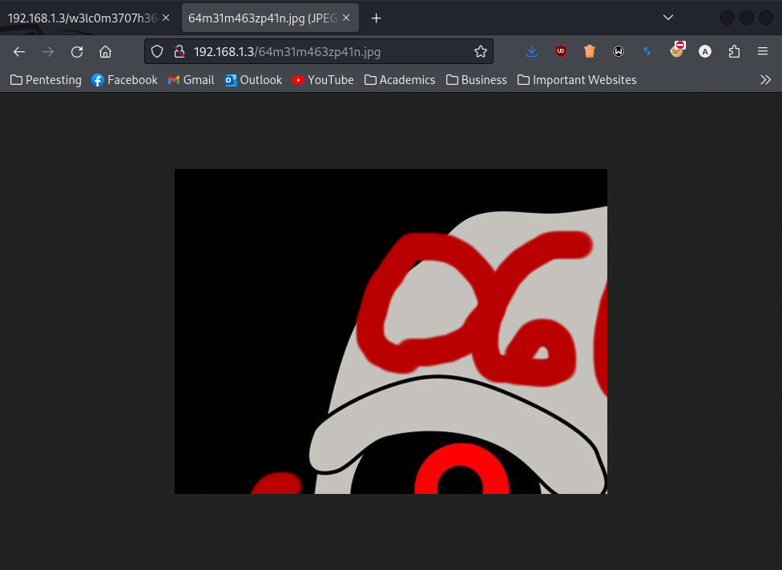

We use the "strings" comm

We extract human-readable printable characters from both .jpg files

We get two leet words in plaintext

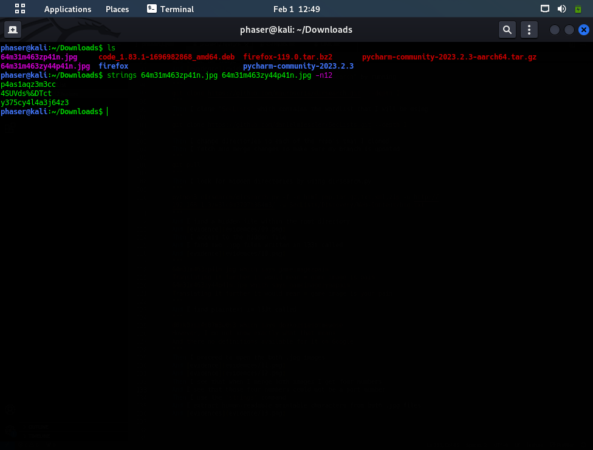

the two leet words are called

    p4as1aqz3m3cc which says paasiaqzemecc
    y375cy4l4a3j64z3 which says yetscyalaaejgaze
    These two leet plaintext words seem to be encoded words
    Therefore we will use a Python script to brute-force
    All possible 25 shifts (rots)
    So we run the phaser12-cipher.py script
    Which is a script to decrypt all 25 rots of a given leet word

We get all 25 possible rots of the leet word "p4as1aqz3m3cc"

We access the "Universal Leet" website

We decode all 25 rots to human-readable text of the script's output

We see that rot 13 translates to "canfindmezepp"

the rest of decoded rots do not translate to existing words in English

We run the phaser12-cipher.py script for "y375cy4l4a3j64z3"

We follow the same process mentioned above

We see that rot 13 translates to "letsplayanewgame"

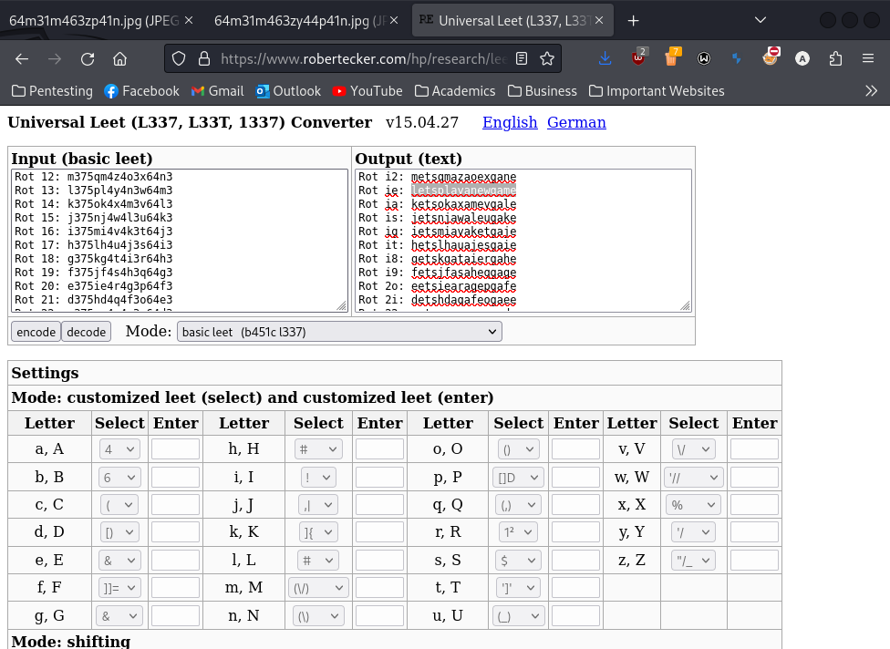

We do the same process for the leet word "d0zk0zsi4s07m3w0s3"

We see that at rot 5 the leet word translates to "youfoundanotherone"

We access the three decoded leet words written as directories

We see that only the path "/y0uf0und4n07h3r0n3" returns an image

We see that there are two leet words in jigsaw's eyes

We see that one of these leet words says "600dj0bp13c3f0und"

We see that the other leet word says "y4y4n07h3r0n36r347"

We use the Universal Leet website to decode these two leet words

We see that these two leet words translate to

    goodjobpiecefound
    yayanotheronegreat

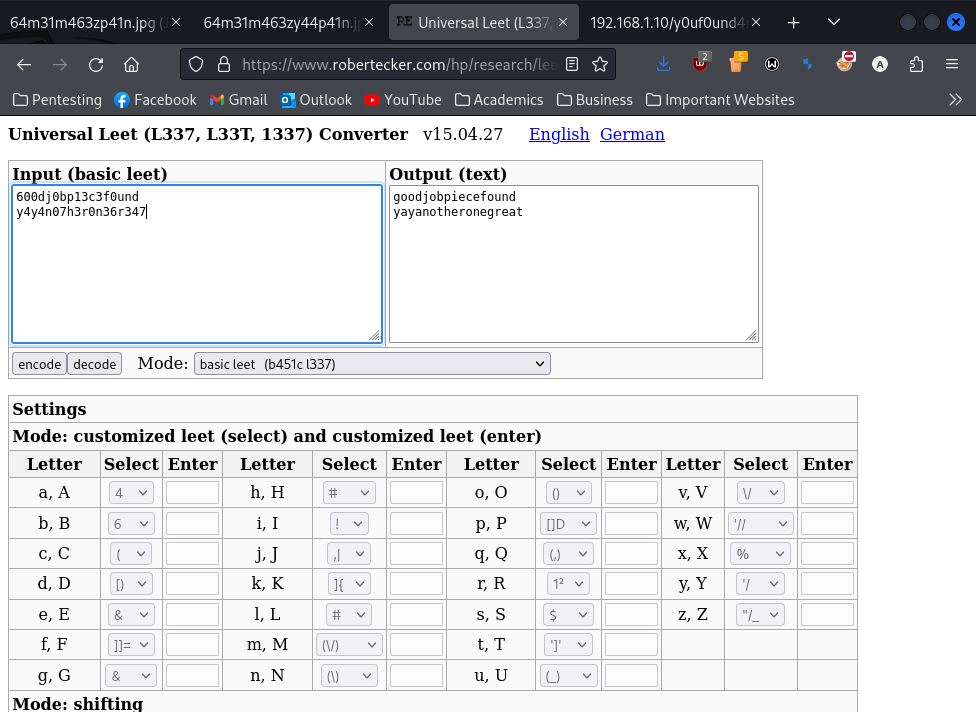

We try to access the word 600dj0bp13c3f0und with .jpg file extension

We get an image

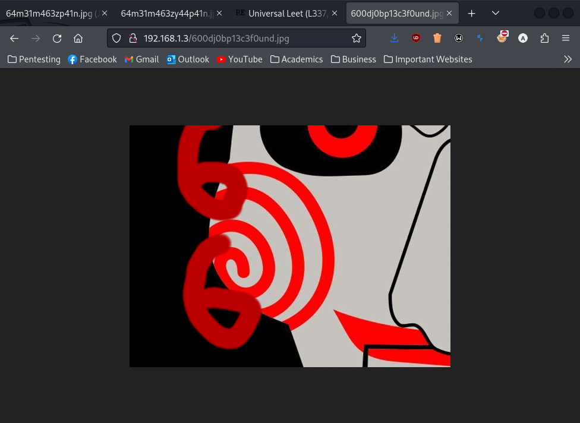

We try to access the word y4y4n07h3r0n36r347 with .jpg file extension

We get another image

We download both .jpg image files

We use the "strings" comm on each of the .jpg files

We try different string lengths by using the "-n" argument

We start with "600dj0bp13c3f0und.jpg"

When we start with "-n1" we see a leet word on last line of the output

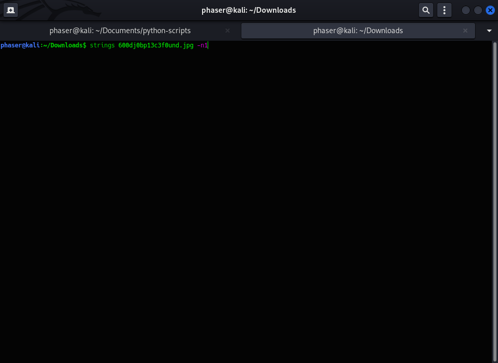

We repeat the same process for "y4y4n07h3r0n36r347.jpg"

We see that each of the leet words correspond to each of the two images

    p0z3s1aqz3 corresponds to 600dj0bp13c3f0und.jpg
    u3ycz3y1s3 corresponds to y4y4n07h3r0n36r347.jpg

We use phaser12-cipher.py script to brute force all 25 rots of "p0z3s1aqz3"

We use the Universal Leet website to decode all 25 rots to English

We see that the translation of "p0z3s1aqz3" is "comefindme" at rot 13

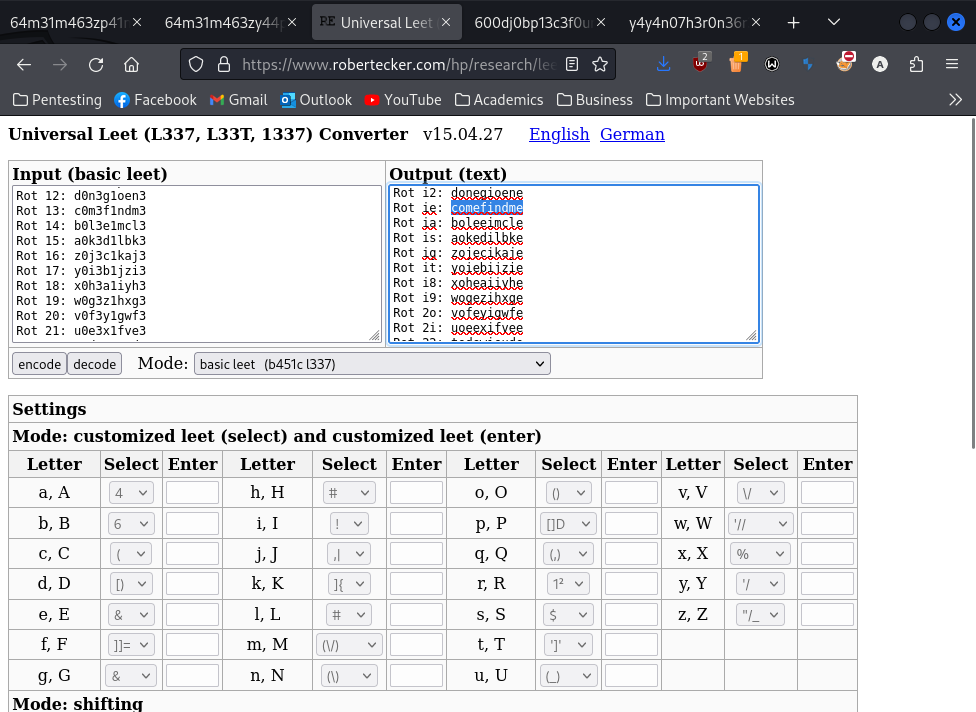

We repeat the same process for "u3ycz3y1s3"

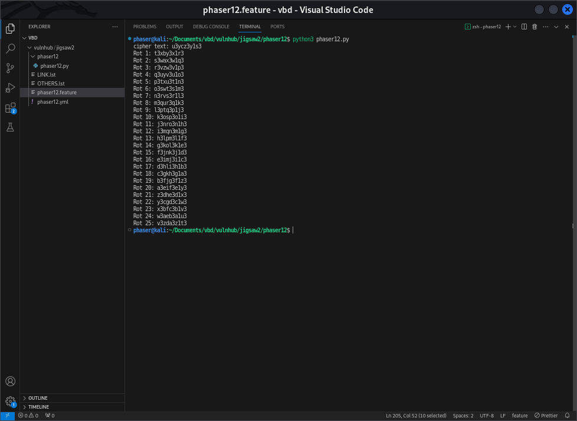

We use httpie to view the source code of

    192.168.1.3/y0uf0und4n07h3r0n3

We find another leet word hidden between html comments

    <!-- Mercy /m3rcyup0ny0u -->

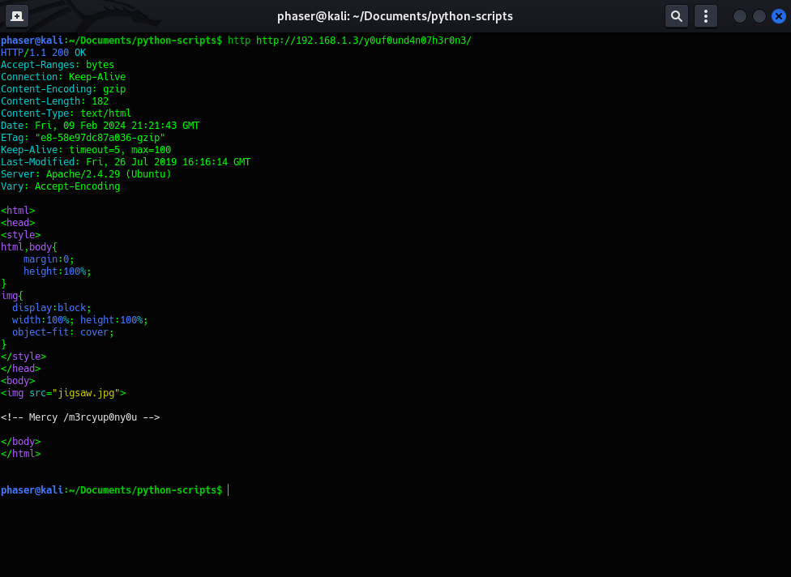

We access the directory "/m3rcyup0ny0u"

We find an image 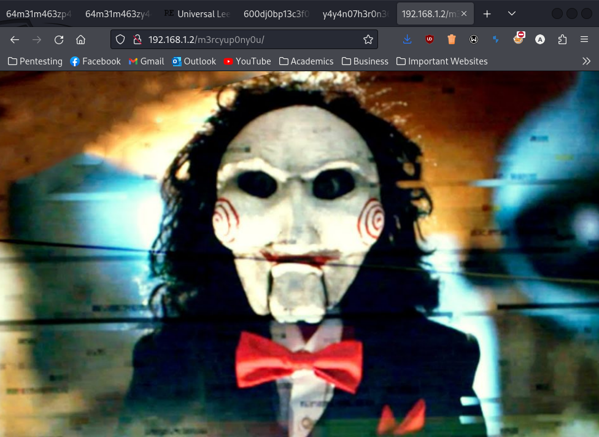

We download the .jpg file

We run strings on "jigsaw.jpg"

We find what appears to be hex characters

We use the Python script "phaser12-hex.py"

We decode the hex characters into ascii characters

We find a string called "f1n4llyy0um4d317h3r3.jpg"

We access the leet word as a path

We get an image 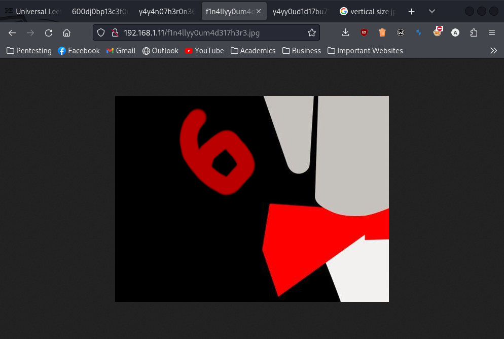

We download the image

We run strings on it 

We find a leet word called "p0z3cy4lj17uz3"

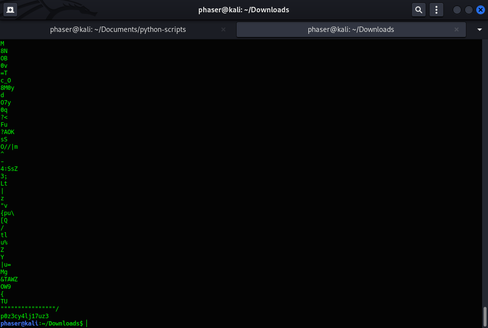

We run phaser12-cipher.py script on "p0z3cy4lj17uz3"

We see that its decoded on rot 13 to "c0m3pl4yw17hm3"

We try to access it as a .jpg file

But it returns a 404 not found status code 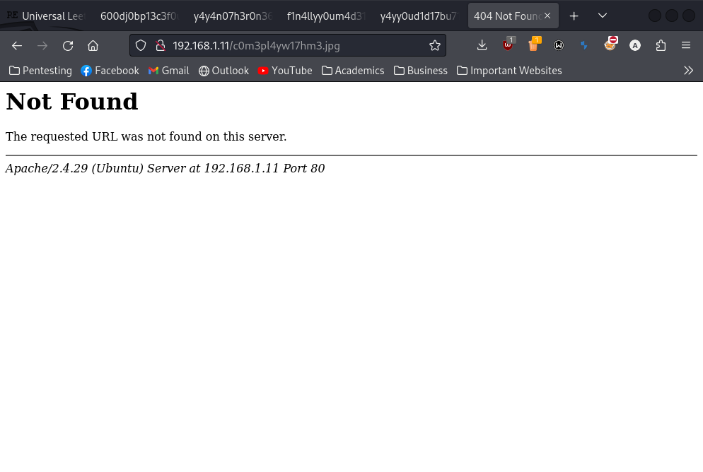

Given it seems to be a dead-end

We decode into base64 the following ascii characters

    eTR5eTB1ZDFkMTdidTcxNzYzNzV3MHI1Ny5qcGc=

We get those ascii characters when We run

    strings jigsaw.jpg -n1

We decode those characters by running phaser12-base64.py

We get the output "y4yy0ud1d17bu7176375w0r57.jpg"

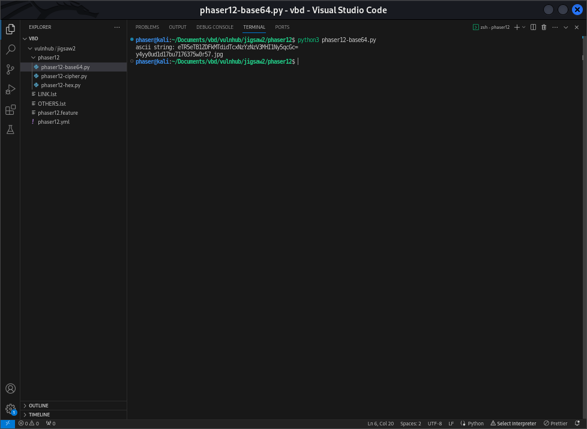

We access the y4yy0ud1d17bu7176375w0r57.jpg file as path

We download it

We run strings on "y4yy0ud1d17bu7176375w0r57.jpg"

We get the leet word "w1654jp4au4px700"

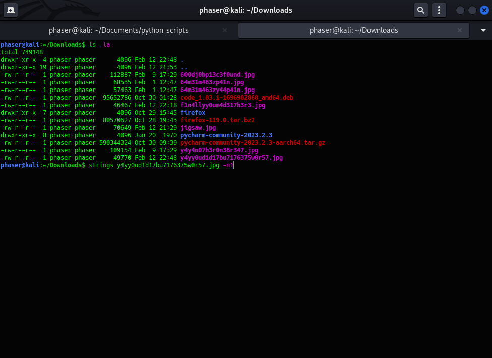

We run phaser12-cipher.py to decode "w1654jp4au4px700"

decode the leet word at rot 13

    j1654wc4nh4ck700
    jigsawcanhacktoo

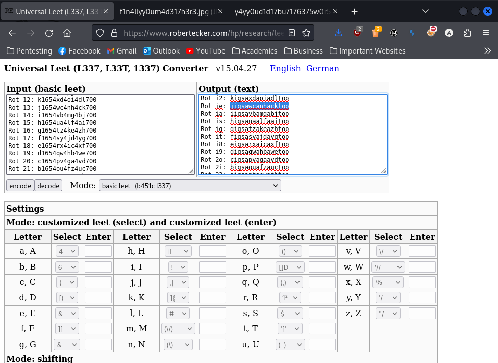

We access j1654wc4nh4ck700 as a .jpg file

But it returns an http 404 status code

Given that it seems like another dead-end

We merge all of the six .jpg images that we have so far

We merge them in the chronological order that we found them

We a get set of 3 different images

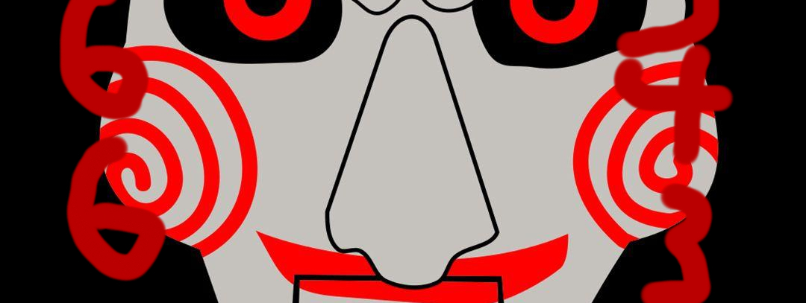

We realize that the 3 images could be one complete image

When we merge them into 1 image

We see the complete image once we put the pieces together

---
### Scenario -- _Exploitation_

Given we have three set of numbers (ports)

We try each set of numbers as the password for jigsaw2 VM

But none of the three sets of numbers were the password

We realize that we already have a set of 6 images

each of these 6 images correspond to a 1 string

We organize each string found on each .jpg file

We put them all together in the chronological order that we found them

We pair each encoded string with its respective decoded string

We input all of the decoded leet strings as a path

We find a file uploader

Given we found a file uploader directory

We try uploading a jpg/png image to test if it allows jpg/png images

We am able to successfully upload jpg/png images

We try to upload a test.py payload

But it did not work

We know that file uploaders typically use FTP port 21 protocol

We did not see port 21 open when we ran nmap before

We proceed to do port knocking to see if we can get port 21 open

We do port knocking with the 3 set of numbers (ports) that we found

When we merged the 6 images previously mentioned

We switch my Kali Linux VM to NAT

We leave jigsaw2 VM on bridged mode

We proceed to do port knocking by running "phaser12-port-knocking.py"

We brute force all possible combinations between the 3 set of ports

We run Nmap to see if any of the port knocking attempts worked

---
### Scenario Outline: Extraction

Given FTP port 21 is now open

We proceed to connect to jigsaw2 VM via FTP

But FTP port 21 is protected by username password credentials

We input "ftp" as username

We input "abcxyz12@gmail.com" email as the password

But that did not work

We input several common passwords for ftp servers such as

    admin, pass, password, root, 12345, test123, user, guest anon

But that did not work either

Given that the password for FTP service is unknown

We do some research we find that there is an index.php file

But we only have access to a portion of the index.php file source code

We connect again to the FTP service

We run "cprf" "cpto" comms to copy the index.php source code

We copy the index.php source code into a code.txt readable file

We use "httpie" to view the source code inside the code.txt file

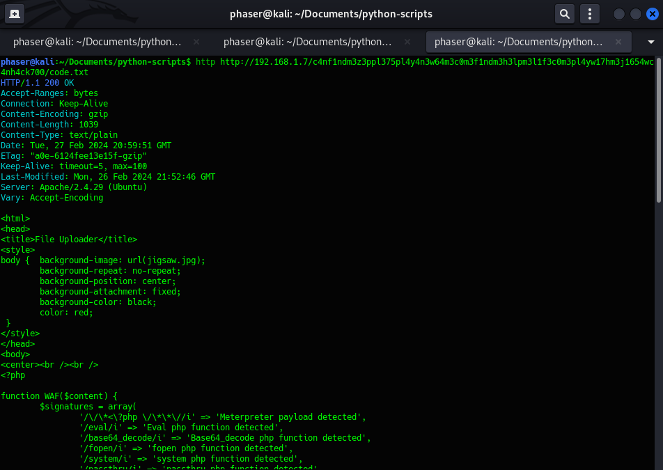

We find the flag within the hidden source code! :)

---
### Scenario -- _Remediation_

Given we an improper access control vulnerability was identified

- The improper access control vulnerability regards FTP commands

  `site cpfr /path-to-resource>`

  `site cpto /path-to-resource>`

- role-based access control mechanisms should be implemented

- attribute-based access control mechanisms should be implemented

- principle of least privilege should be enforced

- only authorized users would be able to access sensitive resources

- the web server's confidentialy integrity would be ensured

---
### Scenario -- _Scoring_

#### _Severity according to CVSSv3 standard_

---

- 8.7/10 (High) - AV:N/AC:H/PR:N/UI:R/S:C/C:H/I:H/A:H

  - Base: Attributes that are constants over time organizations

- 7.2/10 (High) - E:H/RL:O/RC:C/

  - Temporal: Attributes that measure the exploit's popularity fixability

- 7.5/10 (High) - CR:L/IR:L/AR:L
  - Environmental: Unique relevant attributes to a specific user
