## Jigsaw: 2

Documentation referencing vulnerabilites found on the vulnerable machine: **"Jigsaw: 2."** You can also use this documentation as a reference guide to learn ethical hacking.

- The `LINK.lst` file contains the URL to Jigsaw: 2.

## Happy Hacking!

### Feature

- #### Category:

  - _Improper Access Control_

- #### CWE-79:

  - _CWE-285: Improper Authorization_
  - _CWE-540: Information Leak Through Source Code_

- #### Goal:

  - Exploit a port knocking vulnerability on the jigsaw2 VM
  - Exploit an improper access control vulnerability to access vulnerable .php source code

- #### Recommendation:

  - Implement role-based access control mechanisms
  - Implement attribute-based access control mechanisms
  - Implement principle of least privilege

### Hacker's software

| Software Name  | Version  |
| -------------- | -------- |
| Kali Linux     | 5.15.0   |
| Firefox ESR    | 91.5.0   |
| Nmap           | 7.92     |
| HTTPie         | 3.2.1    |
| Dirsearch      | 0.4.3    |
| SecLists       | 2023.4   |
| Strings        | 2.42     |
| Python         | 3.9.10   |
| Universal Leet | 15.04.27 |

### TOE

---

Given I access the Vulnhub website

I download the .7z file associated with "jigsaw2"

I check its MD5 hash code

I check its SHA1 hash code

I confirm that the vulnerable VM's checksums match

I read the vulnerable VM's description which says

    Difficulty: Insane

    It has 2 flags.

    Certain functionality only work with VMware.

I extract the vulnerable VM's .7z file data

I import jigsaw2 .ova file to VMware

### Scenario -- _Normal use case_

Given I start the vulnerable VM on VMware

I see that the vulnerable VM prompts me to a login screen

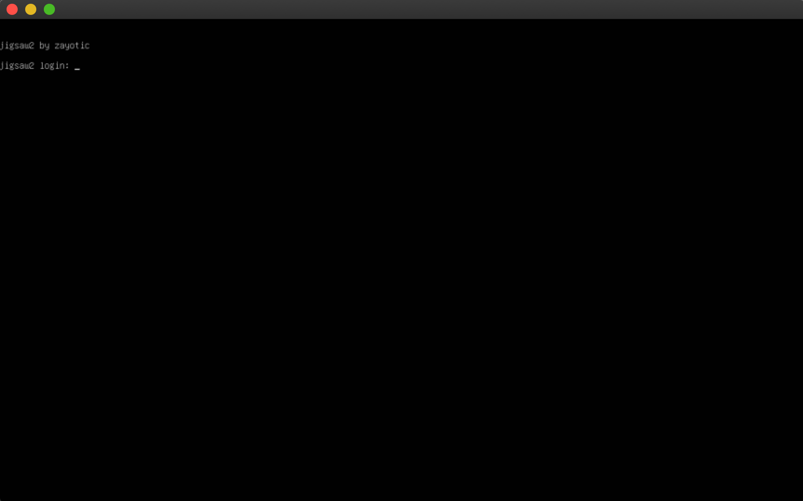

I start my Kali Linux VM on VMware

I set my Kali Linux VM to bridged mode in VMware

I set the vulnerable VM to bridged mode in VMware

both machines are on the same local network

### Scenario -- _Static Detection_

Given both machines are on the same local network

I get the network address of the WLAN

    ip route

### Scenario -- _Dynamic Detection_

Given I have the network address of the WLAN

I use Nmap on my Kali Linux VM

I send ICMP Echo Requests (ping) packets to the network address

    sudo nmap -sn 192.168.1.0/24

I find the vulnerable VM's IP address

I search for open ports on the vulnerable VM using Nmap

I see that "ssh", "http", as well as "rpcbind" ports are open

I check the source code of the site by using "httpie"

I see that it is hosting a file called "main.js"

I see the contents of "main.js" as well as its API

    http http://192.168.1.10/main.js -v

I see a declared variable with var keyword called "\_0x10f6"

this variable has a string written in leet called "/w3lc0m3707h364m3"

When I translate it to English it says "welcome to the game"

I notice that this string has the structure of a path

I input on Firefox ESR

`http://192.168.1.10/w3lc0m3707h364m3/`

I see the main page of the website which contains an image

I clone the web-path-scanning tool "diresearch" by running

`git clone https://github.com/maurosoria/dirsearch.git --depth 1`

I clone "SecLists" which contains the wordlist that I will be using

`git clone https://github.com/danielmiessler/SecLists.git --depth 1`

I change directories to the repo's path on my Kali Linux VM

I fetch merge changes to make sure my branch is updated

`git pull`

I look for hidden directories within "/w3lc0m3707h364m3/" path

I use the dirsearch.py Python program that I cloned earlier to do so

    python3 dirsearch/dirsearch.py -f -e html,php,tar.gz,txt,xml,zip -u http://192.168.1.3/w3lc0m3707h364m3/ -w SecLists/Discovery/Web-Content/big.txt

I find a hidden file within the "/w3lc0m3707h364m3/" path

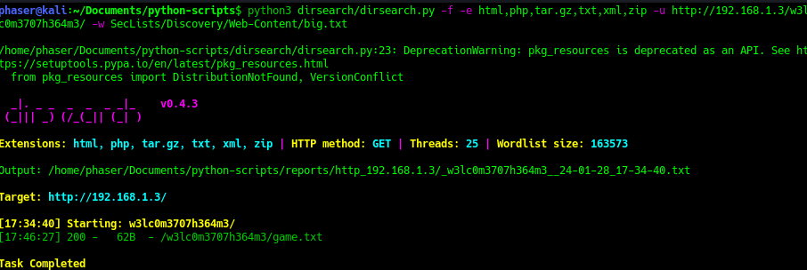

I access to the hidden file

I find two .jpg files written in leet

    64m31m463zp41n.jpg which says gameimagezpain
    Translating it further it would mean = game image is pain
    64m31m463zy44p41n.jpg which says gameimagezyaapain
    Translating it further it would mean = game image is your pain

I find a plaintext word in leet called

    d0zk0zsi4s07m3w0s3 which says dozkozsiasotmewose
    However, I do not know exactly what that means
    there are no definitions available for it on Google

I proceed to open both .jpg images

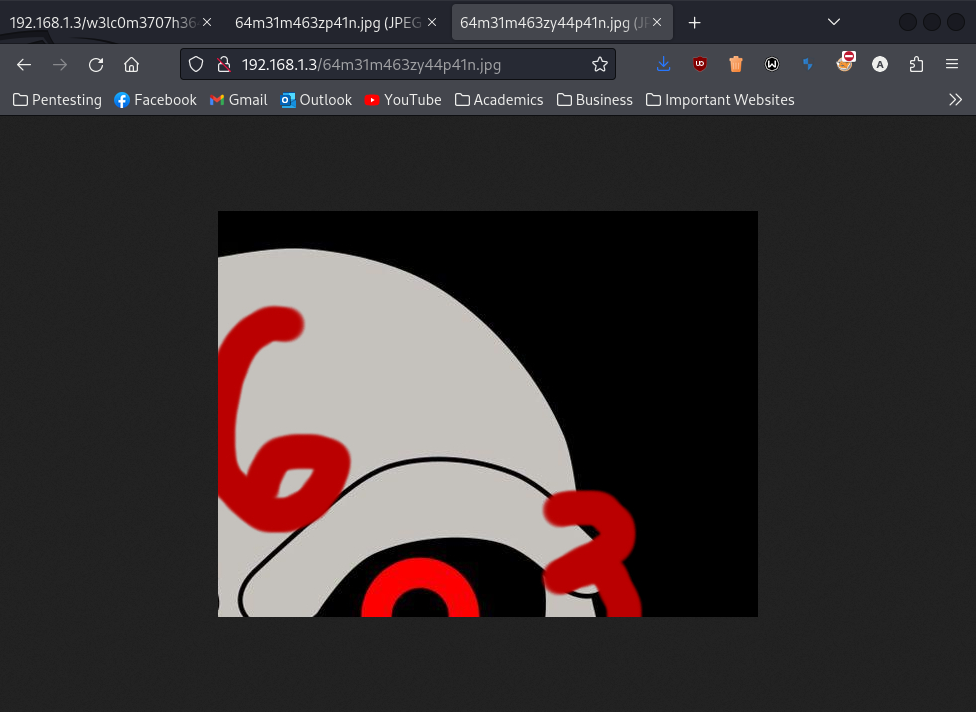

I use the "strings" comm

I extract human-readable printable characters from both .jpg files

I get two leet words in plaintext

the two leet words are called

    p4as1aqz3m3cc which says paasiaqzemecc
    y375cy4l4a3j64z3 which says yetscyalaaejgaze
    These two leet plaintext words seem to be encoded words
    Therefore I will use a Python script to brute-force
    All possible 25 shifts (rots)
    So I run the phaser12.py script
    Which is a script to decrypt all 25 rots of a given leet word

I get all 25 possible rots of the leet word "p4as1aqz3m3cc"

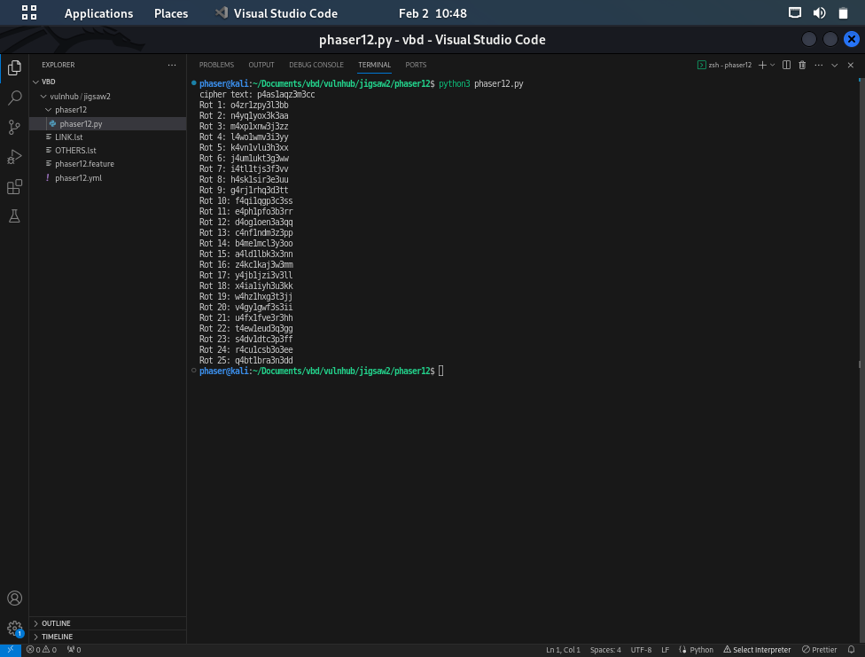

I access the "Universal Leet" website

I decode all 25 rots to human-readable text of the script's output

I see that rot 13 translates to "canfindmezepp"

![evidence][./evidences/14.png]

the rest of decoded rots do not translate to existing words in English

I run the phaser12.py script for "y375cy4l4a3j64z3"

I follow the same process mentioned above

I see that rot 13 translates to "letsplayanewgame"

I do the same process for the leet word "d0zk0zsi4s07m3w0s3"

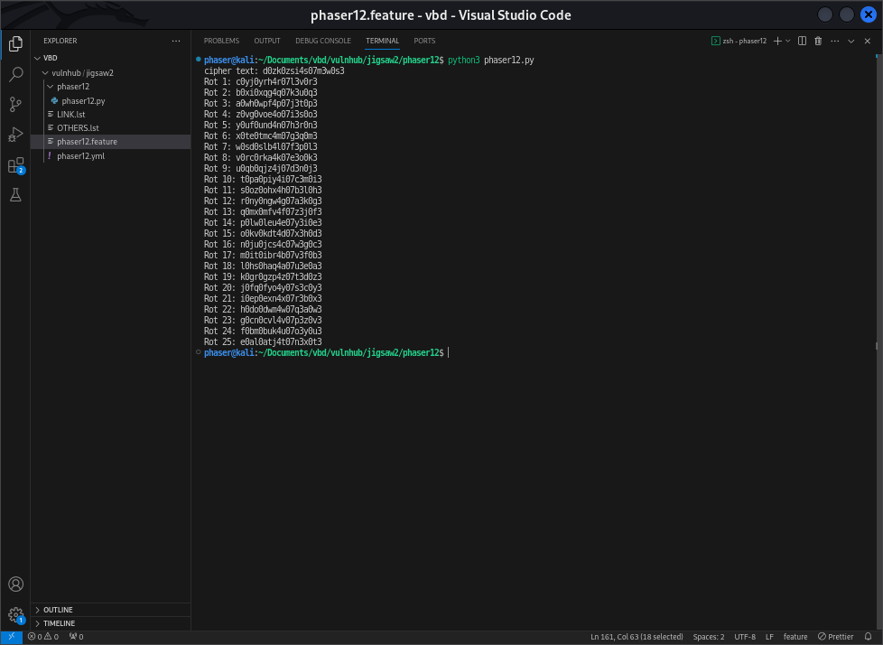

I see that at rot 5 the leet word translates to "youfoundanotherone"

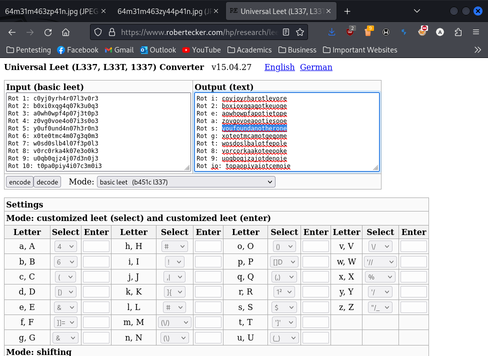

I access the three decoded leet words written as directories

I see that only the path "/y0uf0und4n07h3r0n3" returns an image

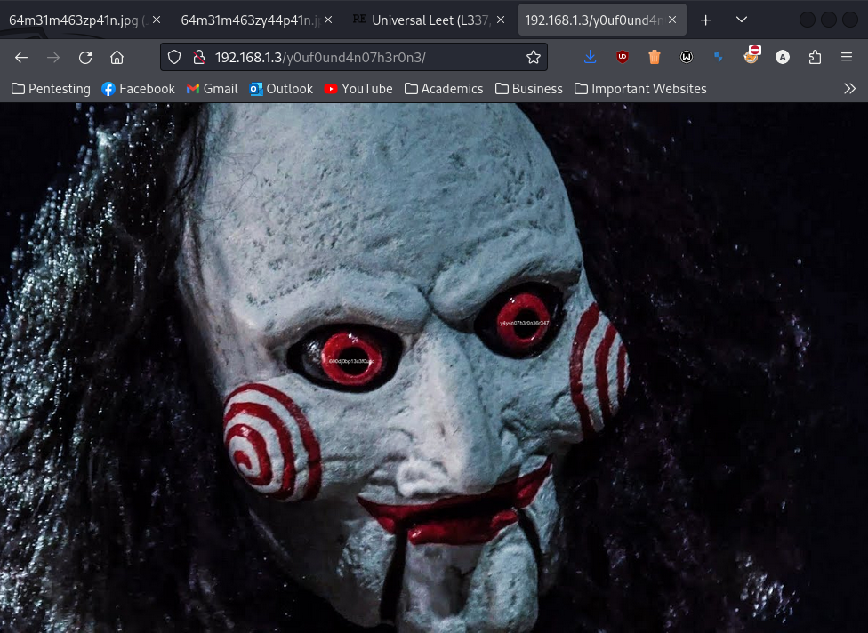

I see that there are two leet words in jigsaw's eyes

I see that one of these leet words says "600dj0bp13c3f0und"

I see that the other leet word says "y4y4n07h3r0n36r347"

I use the Universal Leet website to decode these two leet words

I see that these two leet words translate to

    goodjobpiecefound
    yayanotheronegreat

I try to access the word 600dj0bp13c3f0und with .jpg file extension

I get an image

I try to access the word y4y4n07h3r0n36r347 with .jpg file extension

I get another image

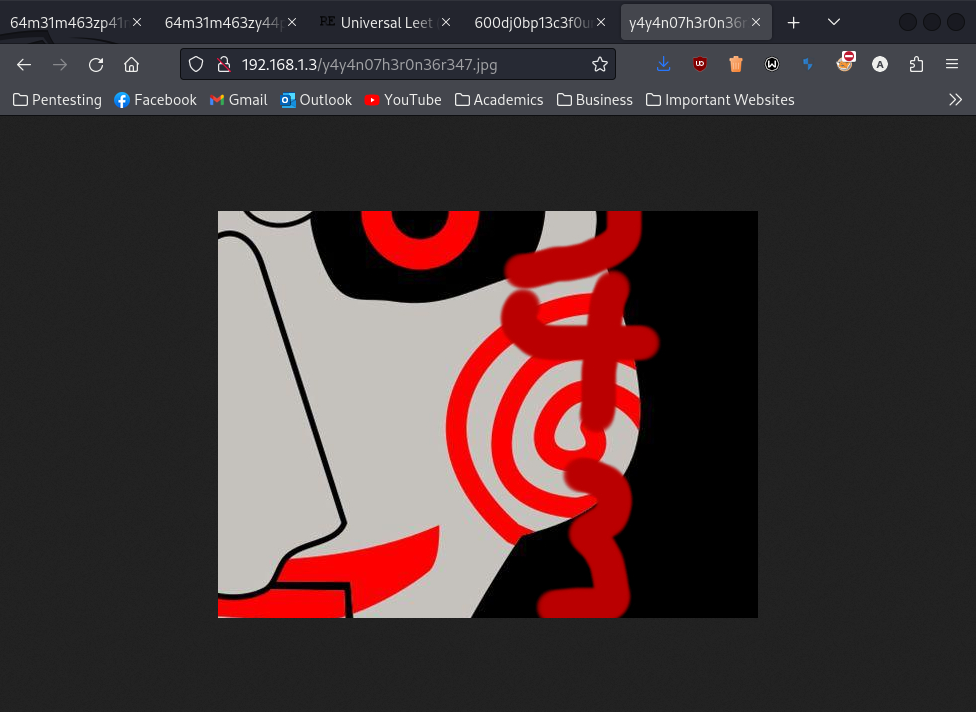

I download both .jpg image files

I use the "strings" comm on each of the .jpg files

I try different string lengths by using the "-n" argument

I start with "600dj0bp13c3f0und.jpg"

When I start with "-n1" I see a leet word on last line of the output

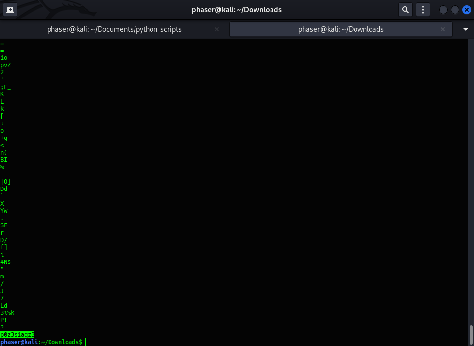

I repeat the same process for "y4y4n07h3r0n36r347.jpg"

I see that each of the leet words correspond to each of the two images

    p0z3s1aqz3 corresponds to 600dj0bp13c3f0und.jpg
    u3ycz3y1s3 corresponds to y4y4n07h3r0n36r347.jpg

I use phaser12.py script to brute force all 25 rots of "p0z3s1aqz3"

I use the Universal Leet website to decode all 25 rots to English

I see that the translation of "p0z3s1aqz3" is "comefindme" at rot 13

I repeat the same process for "u3ycz3y1s3"

I use httpie to view the source code of

    192.168.1.3/y0uf0und4n07h3r0n3

I find another leet word hidden between html comments

    <!-- Mercy /m3rcyup0ny0u -->

I access the directory "/m3rcyup0ny0u"

I find an image 

I download the .jpg file

I run strings on "jigsaw.jpg"

I find what appears to be hex characters

I use the Python script "phaser12-hex.py"

I decode the hex characters into ascii characters

I find a string called "f1n4llyy0um4d317h3r3.jpg"

I access the leet word as a path

I get an image 

I download the image

I run strings on it 

I find a leet word called "p0z3cy4lj17uz3"

I run phaser12-cipher.py script on "p0z3cy4lj17uz3"

I see that its decoded on rot 13 to "c0m3pl4yw17hm3"

I try to access it as a .jpg file

But it returns a 404 not found status code 

Given it seems to be a dead-end

I decode into base64 the following ascii characters

    eTR5eTB1ZDFkMTdidTcxNzYzNzV3MHI1Ny5qcGc=

I get those ascii characters when I run

    strings jigsaw.jpg -n1

I decode those characters by running phaser12-base64.py

I get the output "y4yy0ud1d17bu7176375w0r57.jpg"

I access the y4yy0ud1d17bu7176375w0r57.jpg file as path

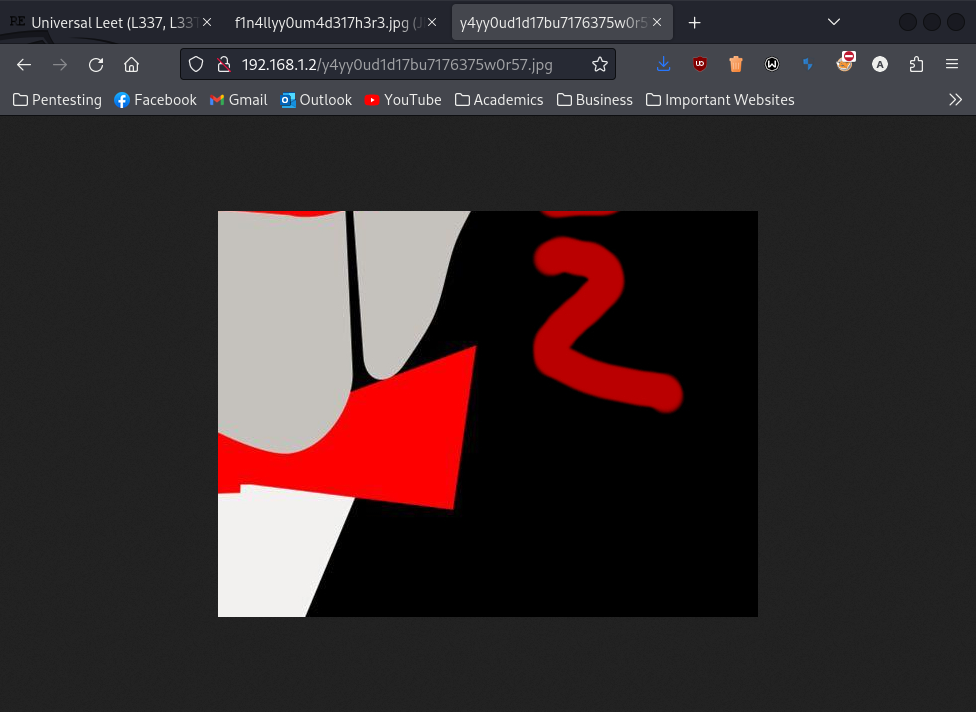

I download it

I run strings on "y4yy0ud1d17bu7176375w0r57.jpg"

I get the leet word "w1654jp4au4px700"

I run phaser12-cipher.py to decode "w1654jp4au4px700"

decode the leet word at rot 13

    j1654wc4nh4ck700
    jigsawcanhacktoo

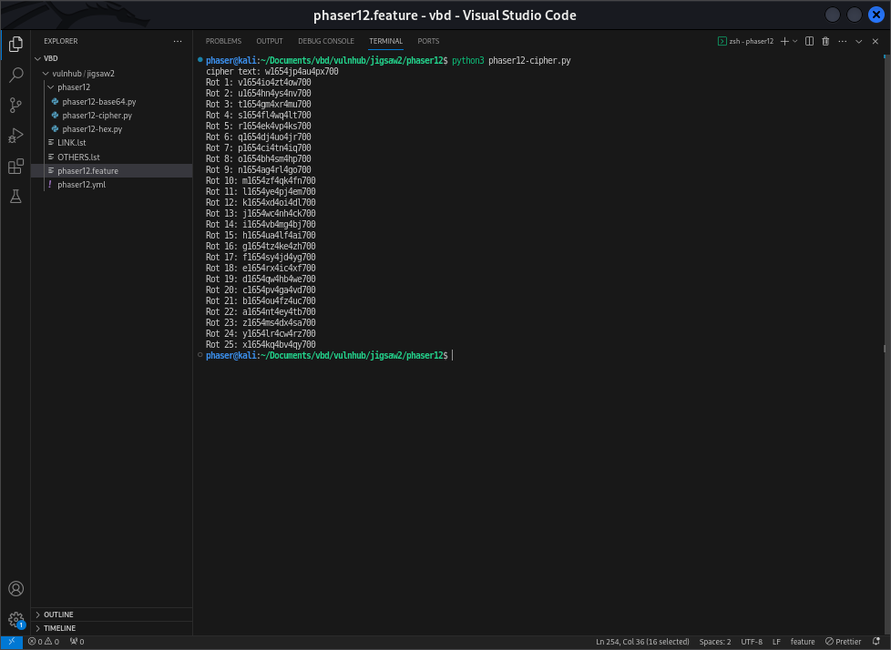

I access j1654wc4nh4ck700 as a .jpg file

But it returns an http 404 status code

Given that it seems like another dead-end

I decide to merge all of the six .jpg images that I have so far

I decide to merge them in the chronological order that I found them

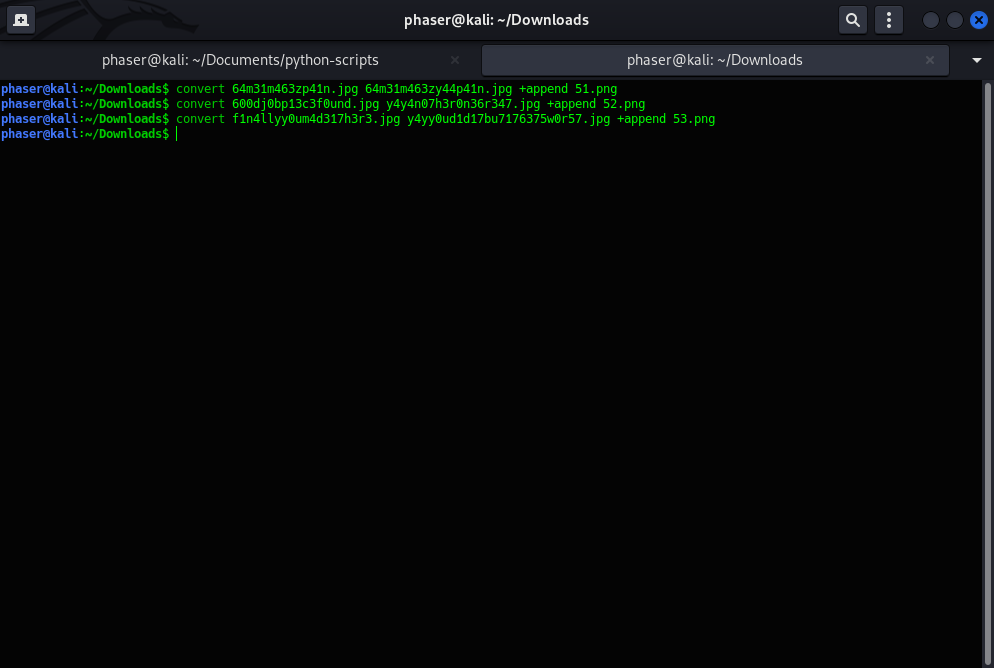

I a get set of 3 different images

I realize that the 3 images could be one complete image

When I merge them into 1 image

I see the complete image once I put the pieces together

### Scenario -- _Exploitation_

Given I have three set of numbers (ports)

I try each set of numbers as the password for jigsaw2 VM

But none of the three sets of numbers were the password

I realize that I already have a set of 6 images

each of these 6 images correspond to a 1 string

I organize each string found on each .jpg file

I put them all together in the chronological order that I found them

I pair each encoded string with its respective decoded string

I input all of the decoded leet strings as a path

I find a file uploader

Given I found a file uploader directory

I try uploading a jpg/png image to test if it allows jpg/png images

I am able to successfully upload jpg/png images

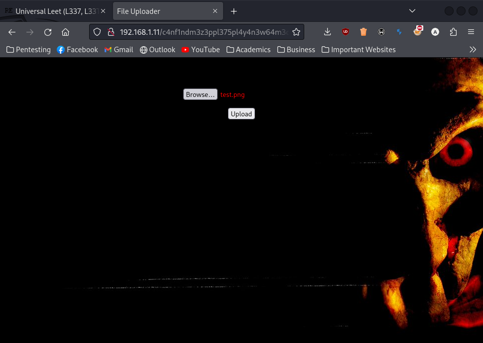

I try to upload a test.py payload

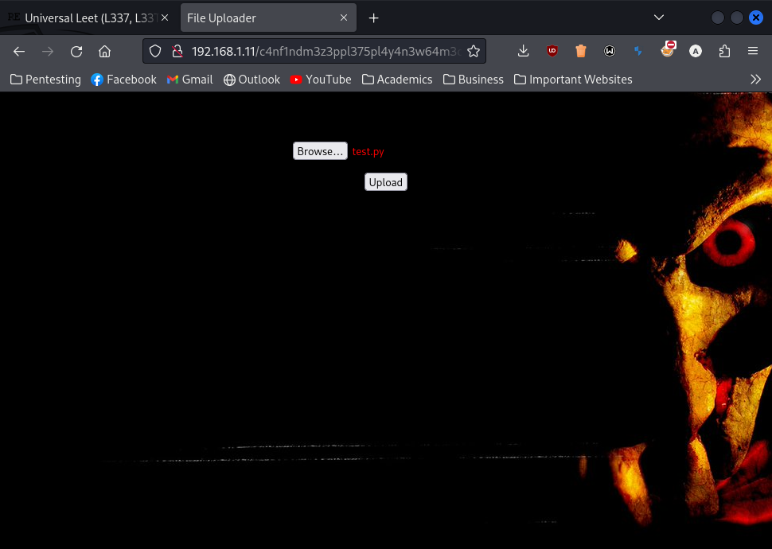

But it did not work

I know that file uploaders typically use FTP port 21 protocol

I did not see port 21 open when I ran nmap before

I proceed to do port knocking to see if I can get port 21 open

I do port knocking with the 3 set of numbers (ports) that I found

When I merged the 6 images previously mentioned

I switch my Kali Linux VM to NAT

I leave jigsaw2 VM on bridged mode

I proceed to do port knocking by running "phaser12-port-knocking.py"

I brute force all possible combinations between the 3 set of ports

I run Nmap to see if any of the port knocking attempts worked

### Scenario Outline: Extraction

Given FTP port 21 is now open

I proceed to connect to jigsaw2 VM via FTP

But FTP port 21 is protected by username password credentials

I input "ftp" as username

I input "abcxyz12@gmail.com" email as the password

But that did not work

I input several common passwords for ftp servers such as

    admin, pass, password, root, 12345, test123, user, guest anon

But that did not work either

Given that the password for FTP service is unknown

I do some research I find that there is an index.php file

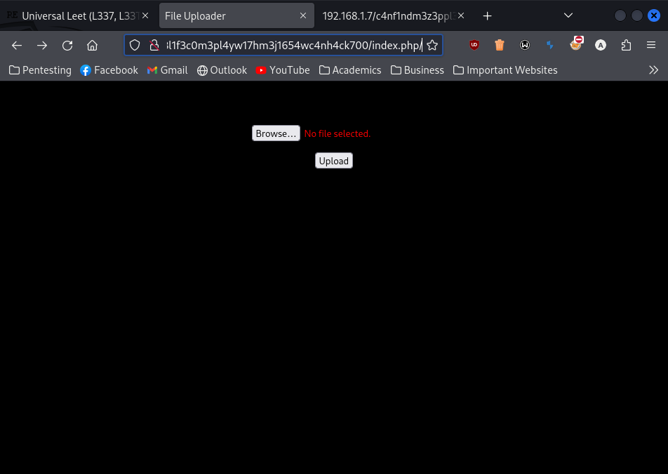

But I only have access to a portion of the index.php file source code

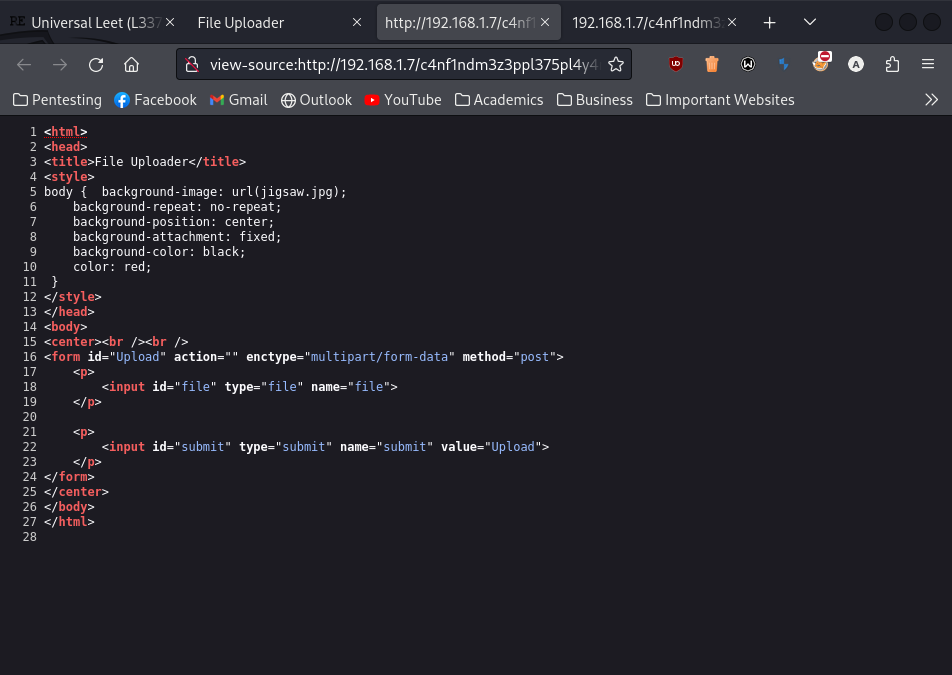

I connect again to the FTP service

I run "cprf" "cpto" comms to copy the index.php source code

I copy the index.php source code into a code.txt readable file

I use "httpie" to view the source code inside the code.txt file

I find the first flag within the hidden source code

### Scenario -- _Remediation_

Given I an improper access control vulnerability was identified

- The improper access control vulnerability regards FTP commands

  `site cpfr /path-to-resource>`

  `site cpto /path-to-resource>`

- role-based access control mechanisms should be implemented

- attribute-based access control mechanisms should be implemented

- principle of least privilege should be enforced

- only authorized users would be able to access sensitive resources

- the web server's confidentialy integrity would be ensured

### Scenario -- _Scoring_

#### _Severity according to CVSSv3 standard_

---

- 8.7/10 (High) - AV:N/AC:H/PR:N/UI:R/S:C/C:H/I:H/A:H

  - Base: Attributes that are constants over time organizations

- 6.9/10 (Medium) - E:H/RL:O/RC:C/

  - Temporal: Attributes that measure the exploit's popularity fixability

- 6.2/10 (Medium) - CR:L/IR:L/AR:L
  - Environmental: Unique relevant attributes to a specific user
