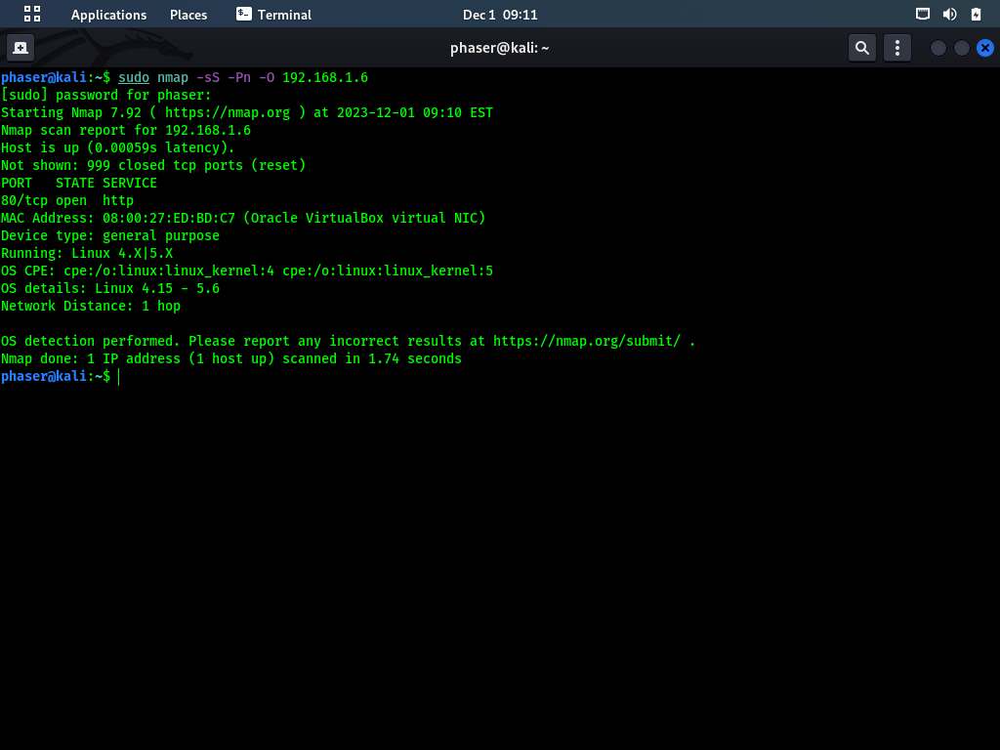
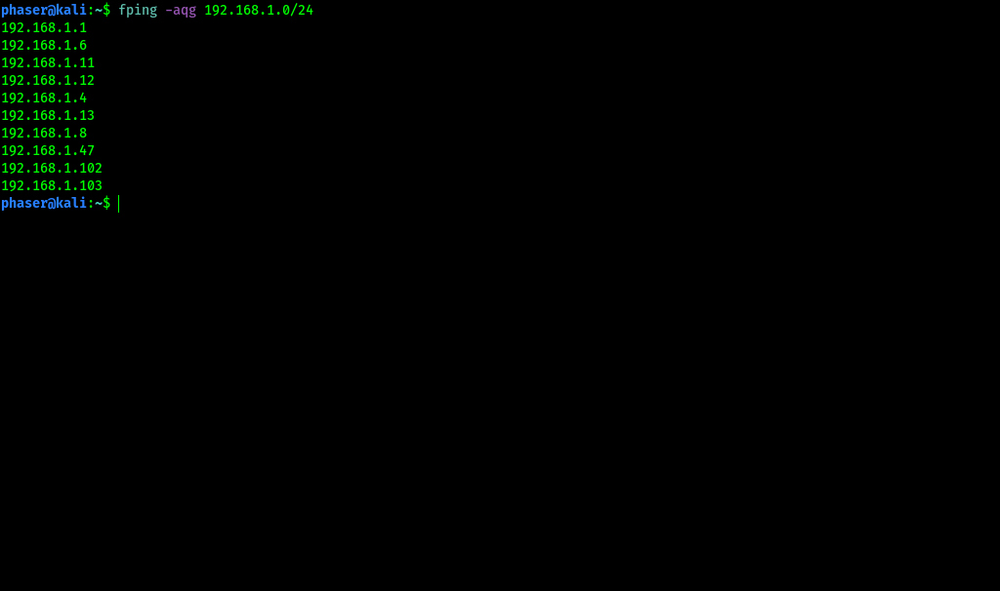
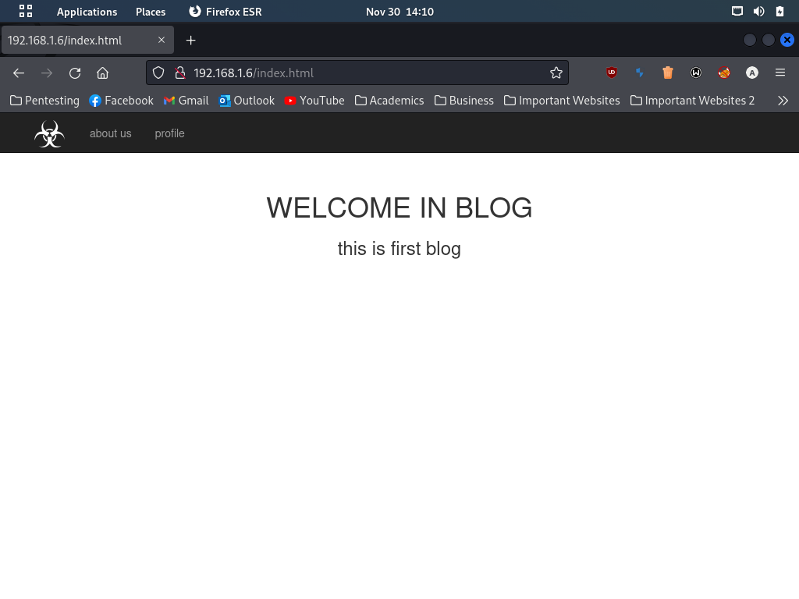
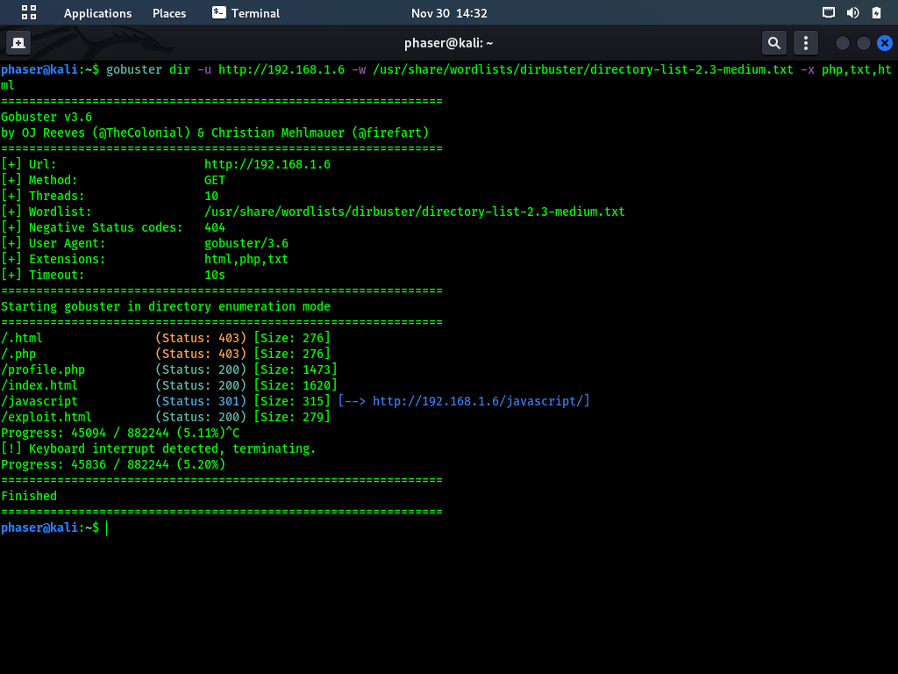
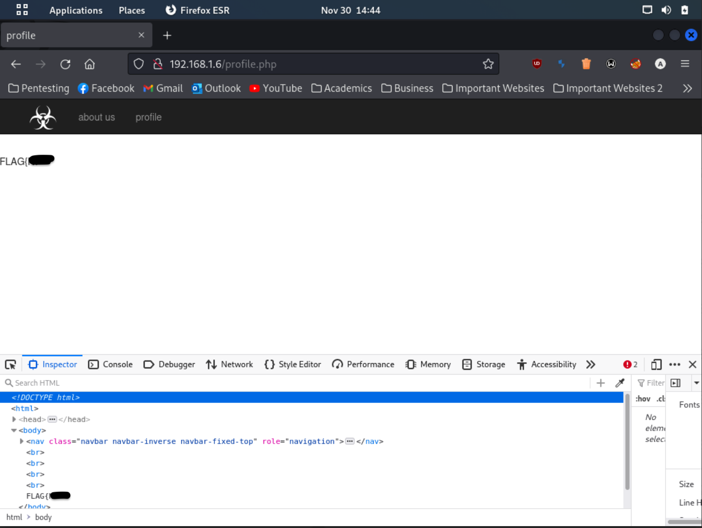
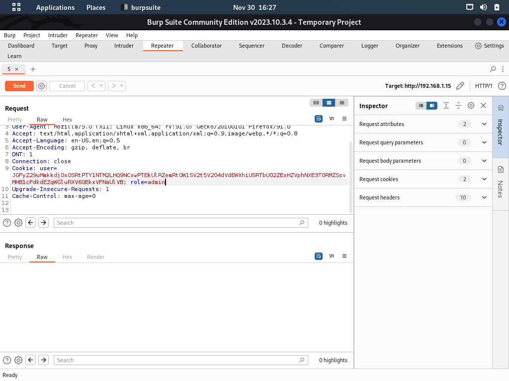

## Web Machine: (N7)

Documentation referencing vulnerabilites found on the vulnerable machine: **''Web Machine: (N7)''**. You can also use this documentation as a reference guide to learn ethical hacking. 

- The `LINK.lst` file contains the URL to Web Machine: (N7).

      Happy Hacking!
---

### Feature

- #### Category:

  - *Reflected XSS*

- #### CWE-79:

  - _Improper Neutralization of Input During Web Page Generation_

- #### Goal:

  - Perform a reflected XSS attack on the vulnerable machine to access admin sensitive information

- #### Recommendation:

  - Implement security attributes for session cookies such as HttpOnly, Secure and SameSite as well as discarding potententially harmful information recieved through data inputs

### Hacker's software

| Software Name      | Version |
| ------------------ | ------- |
| Burpsuite CE       | 10.3.4  |
| Kali Linux         | 5.15.0  |
| Firefox ESR        | 91.5.0  |
| Fping              | 5.1     |
| Gobuster           | 3.6     |
| Nmap               | 7.92    |
| FoxyProxy Standard | 7.5.1   |
| VirtualBox         | 6.1.48  |

### TOE

---

Given we access the Vulnhub website

We download the .ova file associated with "web-machine-n7"

We check the MD5 hash code

      md5 Web-Machine-N7.ova

We check the SHA1 hash code to verify the machine's integrity

      shasum Web-Machine-N7.ova

      We confirm that both of the hash codes match thereby verifying the machine's integrity.

We read the vulnerable VM's description which will potentially give me some clues on how to solve it. The vulnerable VM's description says:

      When starting out to attack the machine, the user might help by making sure the machine is up & running correctly as some machines are easier to discover on the network than others.
      DHCP service: Enabled
      IP address: Automatically assigned

We import the .ova file using VirtualBox

We start the vulnerable VM

We start my Kali Linux VM

We use Nmap on my Kali Linux VM

We discover open ports on the vulnerable machine

We see that port 80 is opened

We see that SSH port 22 is closed

We see that FTP ports 20,21 are also closed

We conclude that we can not SSH or FTP remotely to the vulnerable VM

We conclude that the data hosted on the vulnerable machine is unencrypted

---

### Scenario -- _Normal use case_

Given we set both my "Kali Linux VM" and the "vulnerable VM" to bridged mode in VirtualBox

Now both machines are on the same local network

We get the default gateway IP address of the vulnerable VM

We get its subnet mask by running the following command on my Kali Linux VM

    ip route

We send ICMP echo probes to the gateway's IP address

We find network hosts associated with it

We get the IP address of the vulnerable VM which in this case is (IP addresses are dynamically assigned)

    192.168.1.6

We access the vulnerable machine using Firefox ESR

We see that the vulnerable machine is using an "/index.html" file

We see that the vulnerable VM has a "/profile.php" file

We see that the vulnerable VM has a fragment identifier on the "/profile.php#" file

### Scenario -- _Dynamic Detection_

Given we found the three main visibile directories hosted on the vulnerable VM

We use Gobuster to brute force vulnerable directories on the vulnerable VM

We find that there is a vulnerable file with a 200 status code called

    exploit.html

### Scenario -- _Exploitation_

Given we found a vulnerable file called `"/exploit.html"`

We access the "exploit.html" vulnerable file via Firefox ESR

We open my Firefox ESR web developer tools

We find that there is a URL with a localhost portion in it

We input the vulnerable VM's IP address into the localhost portion

We click on the "Submit Query" button

We find the first flag

We reboot the vulnerable VM

We press on my computer's keyboard the letter "e"

We access the vulnerable machine GUI's firmware

We look for the keyword "ro"

We replace the keyword "ro" with "rw"

We look for the keywords

    "quiet splash"`

We replace the keywords

    "quiet splash" for "init=/bin/bash"

We boot the vulnerable VM by pressing the key `"f10"`

We gain root access to the vulnerable VM's command line interface

We mount the file system by typing the following command on the root CLI

    mount

We change the root user's password by typing the following command

    passwd

We input my new desired root user's password twice

We execute the bootloader by running the following command on the root CLI

    exec /sbin/init

We login to the vulnerable machine using the following credentials

    Username: root
    Password: <password that we set when changing the root password on the root's CLI by running "passwd">

We use Firefox ESR to navigate to the vulnerable VM's root directory

      file:///var/www/html

We notice that there is an `"/enter_network"` directory

We navigate to the `/enter_network` directory using Firefox ESR

We see a login page

We input a random username password

We click on the "Send" button to send an HTTP request to the vulnerable VM

We use Burp Suite with FoxyProxy Standard to capture the HTTP request

We send the HTTP request to the repeater

We find the Base64 encoding value for Set-Cookie=Role

We turn off FoxyProxy Standard on Firefox ESR

We look up the reversed MD5 hash for the Base64 encoded value

We find the reversed MD5 hash value for the Set-Cookie=Role

We brute force vulnerable directories within the /enter_network directory

We notice that there is an `"/admin.php"` file with a 200 status code

We access the /admin.php file through Firefox ESR

We turn on FoxyProxy Standard on Firefox ESR

We make an HTTP request to the endpoint `"/enter_network/admin.php"`

We capture the HTTP request by using Burp Suite with FoxyProxy Standard

We send the HTTP request headers to the repeater

We replace the hash value of "Cookie: Role"

We use its reversed MD5 hash value we found earlier

We send the request through the repeater to capture the response headers

We get the second flag! :)

### Scenario -- _Remediation_

- Given the machine is vulnerable to reflected XSS attacks

- The vulnerable machine is using port 80 which is unencrypted

- Input should be validated by using well-defined regular expressions

- SSL/TLS encryption should be used on port 443
- Use asymmetric encryption to securely exchange the private key
- Use symmetric encryption to encrypt the vulenrable machine's data
- The integrity of data hosted on the vulneable machine will be ensured

### Scenario -- _Scoring_

#### _Severity according to CVSSv3 standard_

---

- 7.6/10 (High) - AV:N/AC:H/PR:N/UI:R/S:C/C:H/I:H/A:H

  - Base: Attributes that are constants over time and organizations

- 7.4/10 (High) - E:H/RL:O/RC:C/

  - Temporal: Attributes that measure the exploit's popularity fixability

- 6.2/10 (Medium) - CR:L/IR:L/AR:L
  - Environmental: Unique relevant attributes to a specific user
